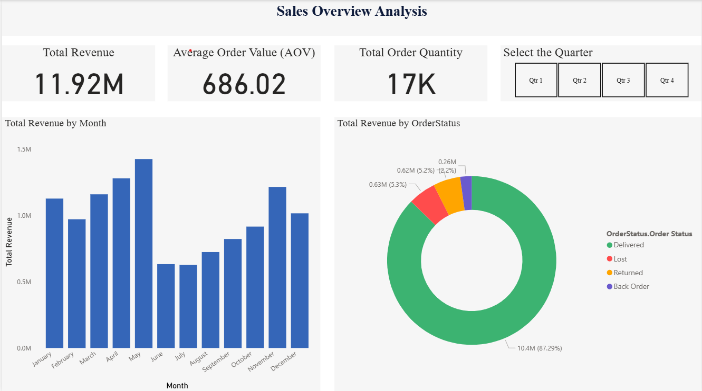
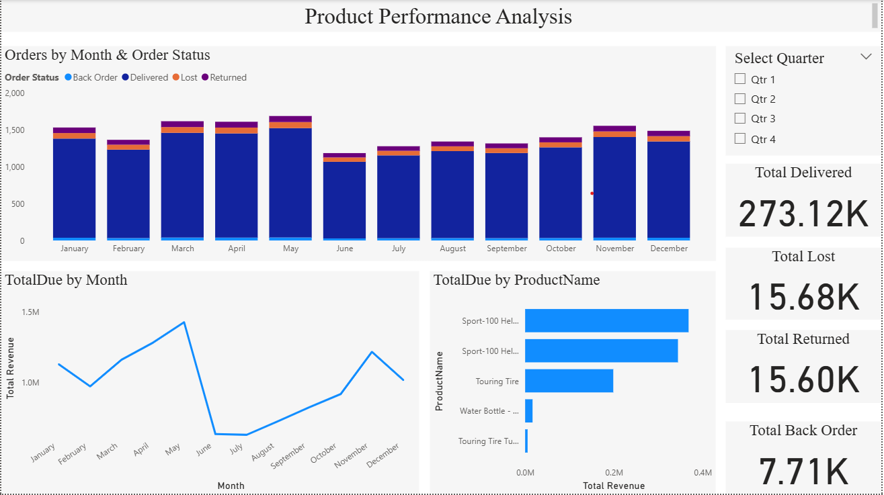

# 🛒 Sales Analysis Project (Excel + SQL + Power Query + Power BI)

## 📌 Project Overview

The Sales Analysis Project focuses on evaluating overall sales performance and product profitability using a complete analytics workflow.  
This project leverages **Excel**, **Power Query**, **SQL**, and **Power BI** to transform raw sales transactions into actionable insights.

It helps uncover:

- Revenue trends  
- Top-performing products  
- Order status behavior  
- Key business KPIs for informed decision-making  

---

## ✨ Features

- 📈 **Sales KPIs** – Total Revenue, AOV, Total Orders  
- 📅 **Monthly Trend Analysis** – Track peak and low-performing months  
- 🏆 **Product Performance Insights** – Identify top revenue drivers  
- 🚚 **Order Status Breakdown** – Delivered, Returned, Lost, Back Order  
- 🔍 **Interactive Power BI Dashboards** – Sales Overview & Product Performance  
- ⚡ **SQL Queries for KPI Extraction** – Revenue, orders, product trends  

---

## 🗂️ Dataset Description

This project uses a single table named **Sales**, containing:

- `SalesOrderID`  
- `OrderQty`  
- `OrderDate`, `DueDate`, `ShipDate`  
- `SubTotal`, `TaxAmt`, `Freight`, `TotalDue`  
- `ProductName`  
- `OrderStatus`  

These fields allow calculation of revenue, product insights, and order trends.

---

## 📊 Dashboards

### **1. Sales Overview Dashboard**

📌 Dashboard Preview

Below is the snapshot of the sales overview Dashboard:

Includes:
- Total Revenue  
- Average Order Value  
- Number of Orders  
- Total Revenue by Month  
- Revenue by Order Status (Pie/Donut Chart)

### **2. Product Performance Dashboard**

📌 Dashboard Preview

Below is the snapshot of the Product Performance Dashboard:

Includes:
- Revenue by Product  
- Monthly Revenue Pattern  
- Returned, Lost, Back Order metrics  
- Top/low performing products  

---

## 🔍 Key Insights

- Total Revenue exceeded **$11M**  
- Delivered orders contribute **~87%** of all revenue  
- **Water Bottle – 30 oz** is the top-performing product  
- Highest sales months: **May** and **November**  
- Returns + Back Orders account for roughly **10%** revenue loss  

---

## 🛠️ SQL Scripts

All SQL queries are included in:

Includes:
- Total revenue  
- Revenue by product  
- Monthly revenue trend  
- Order status performance  
- KPI calculations  

## 🎯 Skills Demonstrated

- SQL (Aggregations, Joins, Grouping, KPI Queries)  
- Excel & Power Query (Data Cleaning & Transformation)  
- Power BI (DAX, Modeling, Dashboard Design)  
- Data Analytics & Visualization  
- Trend, KPI, and Product Analysis  

---

## 🔮 Future Enhancements

- Add Profit & Cost metrics for margin analysis  
- Build forecasting model for upcoming months  
- Add regional sales analysis  
- Automate data refresh with Power BI Gateway  

---

## ✨ Author

**Daksha Mishal**  
📧 dakshamishal52@gmail.com
• GitHub  Mishal30-11 

---
